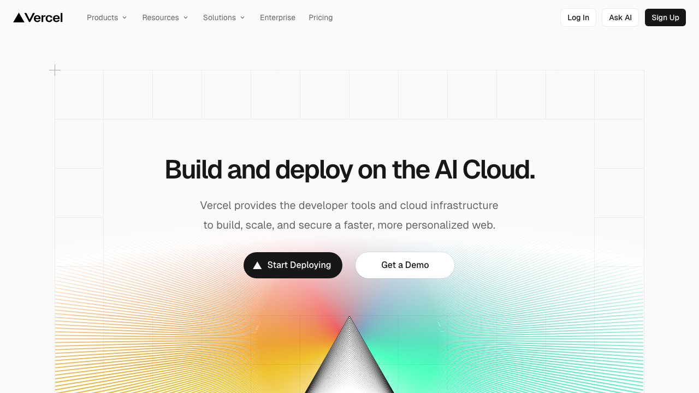
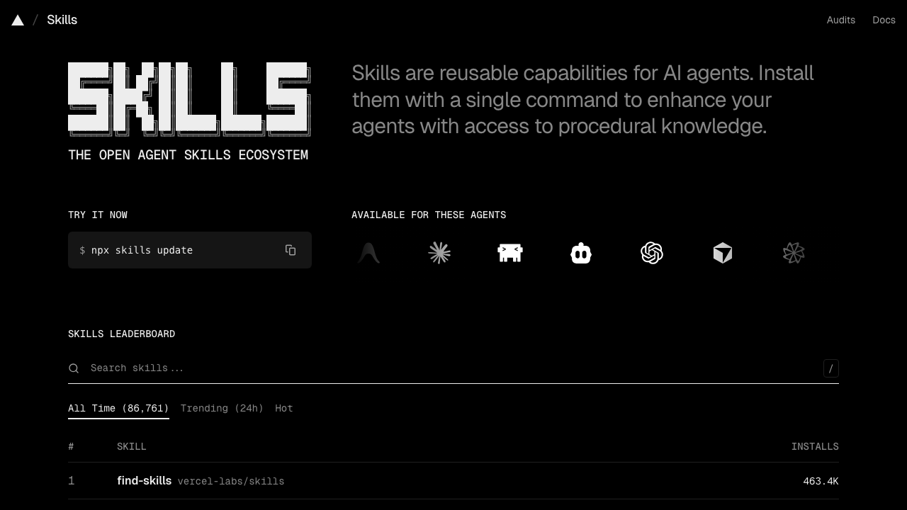
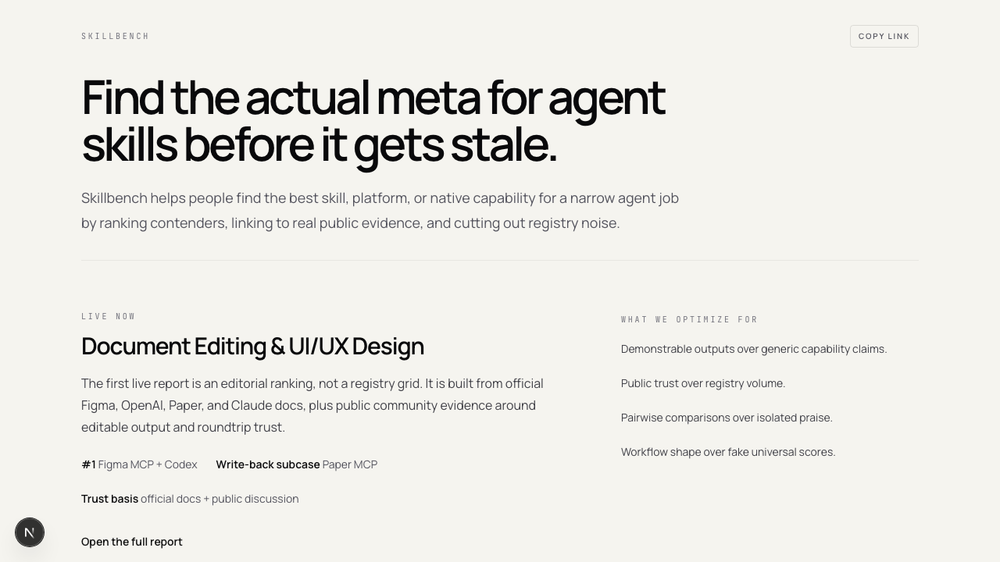
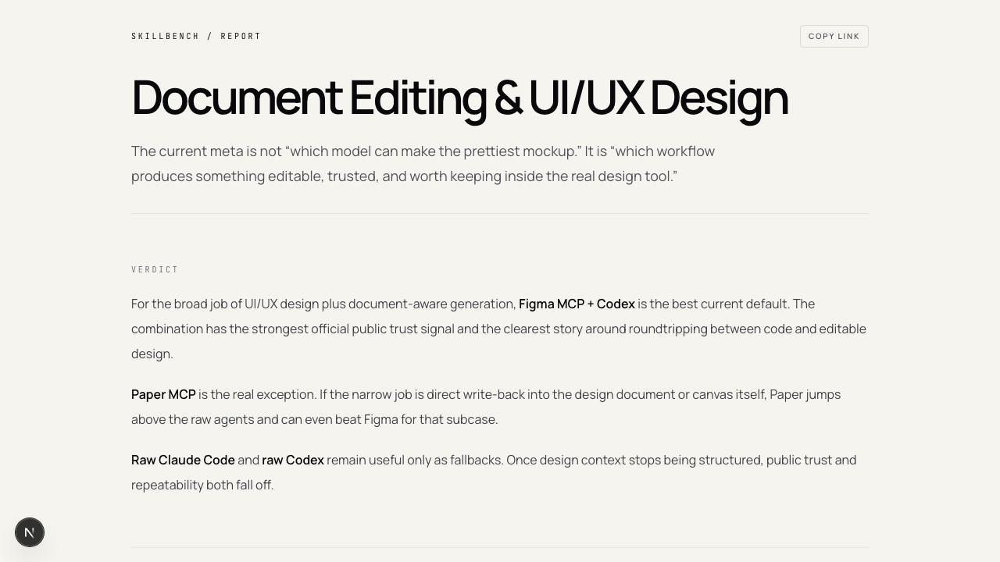

# Design Review Findings

## Scope

Compare Skillbench against Vercel and skills.sh, then get blunt professional UI/UX feedback on where Skillbench still feels wrong.

## Date

2026-03-09 04:40 PDT

## Inputs

- assets/vercel-home.png
- assets/skills-home.png
- assets/skillbench-home.png
- assets/skillbench-report.png
- Gemini CLI visual review

## Findings

- Skillbench was too rounded and too componentized relative to the cleaner editorial feel of Vercel.
- The early version felt like a high-fidelity wireframe rather than a finished product because spacing rhythm and border usage were not disciplined enough.
- Vertical rules and boxed side content created visual noise rather than structure.
- Metadata labels needed to be smaller and more technical in tone.

## Gemini Feedback

- "Skillbench currently sits in an 'uncanny valley' of minimalism."
- "It feels like a high-fidelity wireframe rather than a finished product."
- "Kill the Pill: Change the 'Copy Link' button border-radius from 999px to 4px."
- "Delete Vertical Rules: Remove the vertical lines separating the sidebar."
- "Soften the Lines: Change horizontal rule colors to a very faint #EEEEEE."

## Applied Changes

- copy action changed to a sharper ghost button
- section borders softened
- spacing between major sections increased
- metadata labels reduced and tightened
- heavy card feeling reduced in favor of flatter editorial sections

## Second Review

Gemini's second pass verdict:

- "The revision is a massive improvement."
- "It successfully pivots from a 'generic component kit' feel to a sophisticated, opinionated editorial aesthetic."

Remaining fixes from the second pass:

- reduce copy button radius even further
- strengthen the "Verdict" subhead
- make the homepage report link read more clearly as the main action
- standardize the top-left brand treatment across pages

## Assets

- assets/vercel-home.png
- assets/skills-home.png
- assets/skillbench-home.png
- assets/skillbench-report.png

## Screenshot Review

## Recommended Next Step

Run one more screenshot comparison after the revised layout and continue reducing anything that still feels like a dashboard instead of a report.
