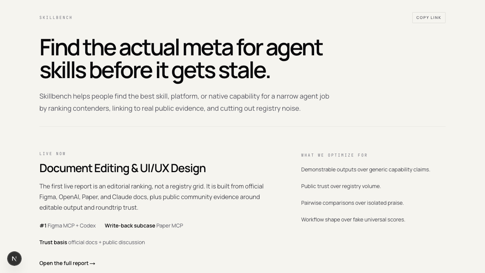
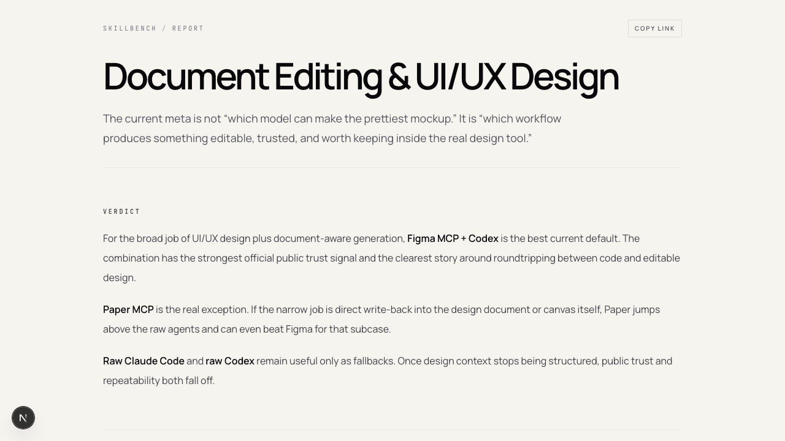
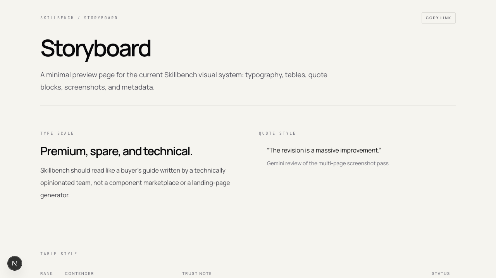
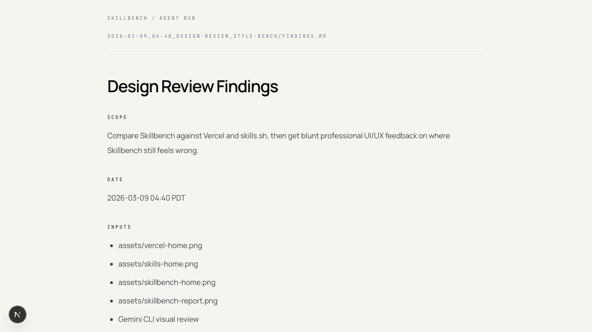

# QA Findings

## Scope

Review the full visible product surface: homepage, report page, storyboard, and rendered agent-run page.

## Date

2026-03-09 06:05 PDT

## Inputs

- homepage screenshot: assets/home.png
- report screenshot: assets/report.png
- storyboard screenshot: assets/storyboard.png
- run page screenshot: assets/run-page.png
- Gemini full-product review

## Findings

- The full product now feels cohesive and intentionally premium/technical rather than like a generic SaaS template.
- The top-level brand treatment is stable across pages.
- The rendered markdown page now behaves like part of the same product rather than a disconnected debug surface.

## Gemini Verdict

- "SHIP IT."
- "The product feels exceptionally cohesive, stable, and intentionally premium/technical."
- "The brand treatment is consistent across all surfaces."

## Fixes Applied After Review

- added copy-link control to rendered markdown pages
- demoted raw file-path metadata so it reads more like document metadata and less like a debug string

## Assets

## Recommended Next Step

Start adding more categories and keep running this QA pass as the product surface expands.
